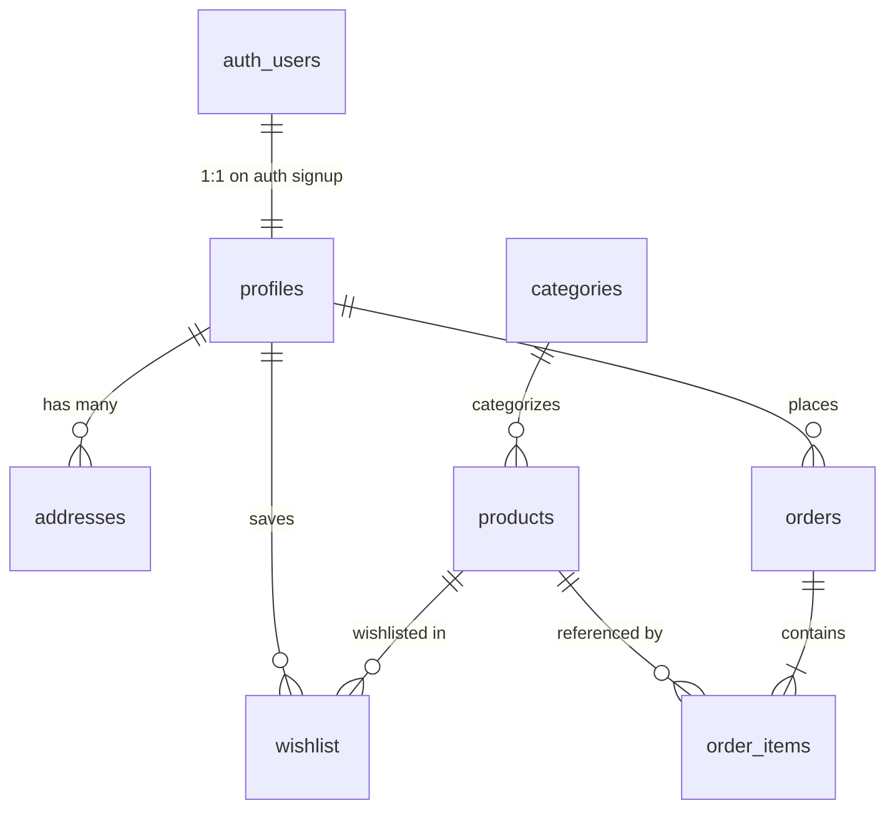

# VELORA E-Commerce - Supabase Database Architecture & Setup Guide

This directory contains the production-ready PostgreSQL database architecture for the **VELORA** e-commerce website. It is designed for **Supabase**, utilizing **Supabase Auth**, **Row Level Security (RLS)**, **INR numeric pricing**, automated timestamp and profile synchronization triggers, and future-ready support for an Admin Panel and authorized external product catalog ingestion.

---

## 1. Database Table Summary

| Table | Purpose | Primary Key | Foreign Keys & Cascades | Key Constraints / Defaults |
| :--- | :--- | :--- | :--- | :--- |
| **`profiles`** | Customer & Admin user profiles | `id UUID` | `REFERENCES auth.users(id) ON DELETE CASCADE` | `role IN ('customer', 'admin') DEFAULT 'customer'` |
| **`categories`** | Catalog category taxonomy | `id UUID` | None | `slug UNIQUE`, `is_active DEFAULT true` |
| **`products`** | Products with INR pricing & variants | `id UUID` | `category_id REFERENCES categories(id) ON DELETE SET NULL` | `slug UNIQUE`, `price NUMERIC(12,2)`, `sizes/colors/images JSONB`, `stock >= 0` |
| **`addresses`** | Saved delivery addresses | `id UUID` | `user_id REFERENCES profiles(id) ON DELETE CASCADE` | `country DEFAULT 'India'`, `address_type IN ('Home', 'Work', 'Other')` |
| **`wishlist`** | Saved items per user | `id UUID` | `user_id REFERENCES profiles(id) ON DELETE CASCADE`,<br>`product_id REFERENCES products(id) ON DELETE CASCADE` | `UNIQUE(user_id, product_id)` |
| **`orders`** | Placed customer orders | `id UUID` | `user_id REFERENCES profiles(id) ON DELETE SET NULL` | `order_number UNIQUE`, `subtotal/tax/shipping/total NUMERIC(12,2)`, `country DEFAULT 'India'` |
| **`order_items`** | Frozen line items per order | `id UUID` | `order_id REFERENCES orders(id) ON DELETE CASCADE`,<br>`product_id REFERENCES products(id) ON DELETE SET NULL` | Frozen snapshot of `product_name`, `price`, `selected_size`, `selected_color` |

---

## 2. Relationships & Data Flow Diagram



---

## 3. Row Level Security (RLS) Matrix

All tables have Row Level Security enabled. Security policies are enforced at the database engine level:

| Table | Public / Guest | Authenticated Customer | Admin (`profiles.role = 'admin'`) |
| :--- | :--- | :--- | :--- |
| **`categories`** | Read only (`is_active = true`) | Read only (`is_active = true`) | Full CRUD (`is_admin() = true`) |
| **`products`** | Read only (`is_active = true`) | Read only (`is_active = true`) | Full CRUD (`is_admin() = true`) |
| **`profiles`** | None | Read own profile, update own profile | Read all profiles, manage roles |
| **`addresses`** | None | Full CRUD on own addresses (`user_id = auth.uid()`) | View all addresses |
| **`wishlist`** | None | Full CRUD on own wishlist items | View all |
| **`orders`** | None (or guest order insert) | Read & insert own orders (`user_id = auth.uid()`) | View & update all orders (dispatch, status) |
| **`order_items`** | None | Read & insert items belonging to own orders | View all order items |

> [!NOTE]
> Admin access is determined via a secure `SECURITY DEFINER` function `public.is_admin()`. This inspects the caller's `role` in `public.profiles` while bypassing recursion loops.

---

## 4. Setup Instructions (Supabase Dashboard)

1. Log in to your [Supabase Dashboard](https://app.supabase.com/) and open or create your project.
2. Navigate to the **SQL Editor** tab in the left sidebar.
3. Open the file [`supabase/full_setup.sql`](./full_setup.sql) in this directory.
4. Copy the entire contents and paste them into a new query in the Supabase SQL Editor.
5. Click **Run** (or press `Cmd+Enter` / `Ctrl+Enter`).
6. Supabase will execute all table creations, foreign keys, triggers, RLS policies, and seed all 8 categories and 24 sample products in INR.
7. To verify, go to **Table Editor** in Supabase and check that all 7 tables (`profiles`, `categories`, `products`, `addresses`, `wishlist`, `orders`, `order_items`) are populated with the schema and demo data.

---

## 5. Setting Up an Admin User

By default, any user signing up through Supabase Auth is assigned the `customer` role. To promote a user to **admin**:

```sql
-- Run in Supabase SQL Editor after user signs up:
UPDATE public.profiles
SET role = 'admin'
WHERE email = 'admin@velora.com'; -- Replace with your admin email
```

---

## 6. Frontend Connection Guide (When Ready)

When you are ready to connect the VELORA frontend to Supabase:

### Step 1: Add the Supabase JS Client
Add the official Supabase CDN script in your HTML `<head>`:
```html
<script src="https://cdn.jsdelivr.net/npm/@supabase/supabase-js@2"></script>
```

### Step 2: Initialize Supabase Client
Create a file `js/supabaseClient.js`:
```javascript
const SUPABASE_URL = 'https://YOUR_PROJECT_ID.supabase.co';
const SUPABASE_ANON_KEY = 'YOUR_SUPABASE_ANON_KEY'; // NEVER expose service-role key!

const supabase = window.supabase.createClient(SUPABASE_URL, SUPABASE_ANON_KEY);
window.supabase = supabase;
```

### Step 3: Querying Example (Shop Page)
```javascript
// Fetch active products with category
const { data: products, error } = await supabase
  .from('products')
  .select('*, categories(name, slug)')
  .eq('is_active', true)
  .order('created_at', { ascending: false });
```

### Step 4: Auth Adapter Replacement (`js/auth.js`)
The existing `js/auth.js` is already built with an adapter structure. To switch from localStorage to Supabase:
- Replace mock login with `await supabase.auth.signInWithPassword({ email, password })`
- Replace mock signup with `await supabase.auth.signUp({ email, password, options: { data: { full_name, phone } } })`
- Replace mock logout with `await supabase.auth.signOut()`
